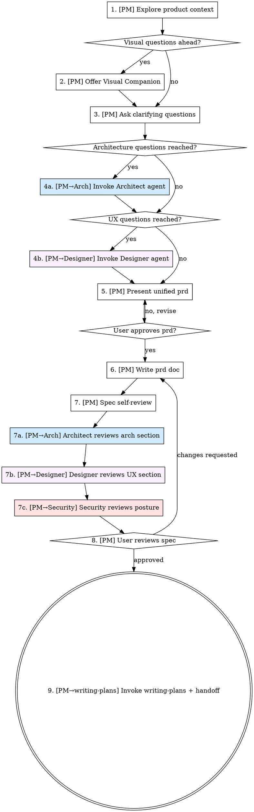

# Brainstorming Ideas Into PRDs (Multi-Agent)

Help turn ideas into fully formed designs and specs through natural collaborative dialogue, with each agent contributing only within its role and passing a structured handoff payload to the next.

Start by understanding the current product context, then ask questions one at a time to refine the idea. Once you understand what you're building, present the design and get user approval.

<HARD-GATE>
Do NOT invoke any implementation skill, assign implementation tasks, write any code, scaffold any product, or take any implementation action until you have presented a design and the user has approved it. This applies to EVERY product regardless of perceived simplicity.
</HARD-GATE>

<ROLE-GATE>
Before starting: invoke the **role-boundaries** skill and confirm your declared role.

- **Driving the spec (questions, approaches, scope):** Product Manager agent only.
- **Architecture sections:** Architect agent contributes when PM reaches architecture questions — PM invokes Architect, not the other way around.
- **Visual/UX sections:** UI/UX Designer agent contributes when PM reaches UI/UX questions — PM invokes Designer.
- If you are a dev, QA, security, or infrastructure agent — do NOT drive brainstorming. Stop and hand off to the PM agent.
</ROLE-GATE>

---

## Agent Roster for This Skill

| Step | Agent | Role |
|---|---|---|
| 1–3 | **PM agent** | Drives context, scope, clarifying questions |
| 4a | **Architect agent** | Proposes and reviews architecture approaches |
| 4b | **UI/UX Designer agent** | Proposes visual/UX approaches (if applicable) |
| 5 | **PM agent** | Presents unified design, collects approval |
| 6 | **PM agent** | Writes and commits spec document |
| 7 | **PM agent** | Self-reviews spec |
| 7a | **Architect agent** | Reviews architecture section of spec |
| 7b | **UI/UX Designer agent** | Reviews UX/visual section of spec (if applicable) |
| 7c | **Security agent** | Flags security posture gaps (advisory, non-blocking) |
| 8 | **PM agent** | Presents spec to user for final approval |
| 9 | **PM agent** | Invokes writing-plans; passes handoff payload to Architect + dev roles |

---

## Anti-Pattern: "This Is Too Simple To Need A Design"

Every product goes through this process. A todo list, a single-function utility, a config change — all of them. "Simple" products are where unexamined assumptions cause the most wasted work. The design can be short (a few sentences for truly simple products), but you MUST present it and get approval.

---

## Checklist

You MUST create a task for each of these items and complete them in order:

1. **[PM] Explore product context** — check files, docs, recent commits
2. **[PM] Offer visual companion** (if topic will involve visual questions)
3. **[PM] Ask clarifying questions** — one at a time
4. **[PM → Architect] Invoke Architect for architecture approaches**
4b. **[PM → Designer] Invoke UI/UX Designer for visual/UX approaches** (if applicable)
5. **[PM] Present unified design** — consolidate inputs, get user approval per section
6. **[PM] Write prd doc** — save to `~/ai-delivery-org-docs/wiki/product/specs/YYYY-MM-DD-<topic>-prd.md` and commit
7. **[PM] Spec self-review** — quick inline check
7a. **[PM → Architect] Architect reviews architecture section**
7b. **[PM → Designer] Designer reviews UX section** (if applicable)
7c. **[PM → Security] Security agent reviews for posture gaps** (advisory)
8. **[PM] User reviews written spec**
9. **[PM → writing-plans + Architect + dev roles] Transition to implementation**

---

## Process Flow




---

## The Process — Step by Step

---

### Step 1 — [PM Agent] Explore Product Context

**Actor:** PM agent  
**Action:** Read current product state — files, docs, existing code scaffolds, recent commits, existing specs.

**Checklist — expand beyond docs:**

1. **Project directory conventions** — Establish where code lives. Check for a project-level AGENTS.md for directory conventions, or ask the user. Common pattern: `/root/ai-delivery-org-code/internal-tools/` for team-internal tools, `/root/ai-delivery-org-code/` for runtime products, with a subfolder per project.
2. **Existing code scaffolds/repos** — Check for prior work in the project directory. Look for apps, components, data contracts, types, tests, sample fixtures — these may be salvageable even if the user plans to rebuild from scratch. Note what can be reused (type definitions, data contracts, component APIs, UX patterns).
3. **Existing prd docs** — `~/ai-delivery-org-docs/wiki/product/specs/`
4. **CLAUDE.md / AGENTS.md** — project-level agent instructions (check the project root and `.hermes/` directory)
5. **Recent git log** — what changed recently
6. **Open tickets / ADRs** — decisions in flight
7. **Reference target URL** — if the user provided a reference URL (e.g. a Vercel preview), browse it to understand the target layout, data model, and UX patterns before asking questions.

**Pitfall — scrapped scaffold reuse:** When the user removes old scaffold work and starts fresh, the types, data contracts, and test helpers from the old work are often salvageable. Ask whether to reuse them before rewriting. This saves significant rework.

**Establish repo conventions early:** Ask about GitHub username, repo name, and whether project directory name should match repo name. The user may have a fixed convention (e.g. subfolder name = repo name, push via `governed-github-repos` skill).

No handoff at this step. PM agent proceeds to Step 2.

---

### Step 2 — [PM Agent] Offer Visual Companion

**Actor:** PM agent  
**Action:** If upcoming questions will involve visual content (layouts, diagrams, flows), offer the companion once — in its own message, no other content.

> "Some of what we're working on might be easier to explain if I can show it to you in a web browser. I can put together mockups, diagrams, comparisons, and other visuals as we go. This feature is still new and can be token-intensive. Want to try it? (Requires opening a local URL)"

**This offer MUST be its own message.** Wait for user response before continuing.

If accepted, load the `visual-mockup-delivery` skill before proceeding.

---

### Step 3 — [PM Agent] Ask Clarifying Questions

**Actor:** PM agent  
**Action:** Ask questions one at a time to understand purpose, constraints, and success criteria. Prefer multiple-choice when possible.

**Scope check before asking detailed questions:**
- If the request spans multiple independent subsystems, flag and decompose first. Don't refine details of a product that needs to be split.
- Each sub-product gets its own spec → plan → implementation cycle.

When questions touch **architecture or technical stack**, PM agent does not answer them alone — proceed to Step 4a.  
When questions touch **UI/UX or visual design**, proceed to Step 4b.

---

### Step 4a — [PM → Architect Agent] Architecture Approaches

**Actor:** PM agent invokes Architect agent.

**When to invoke:** As soon as clarifying questions surface decisions about system design, technology stack, component boundaries, data flow, scalability, or API contracts.

**PM agent sends this handoff payload to the Architect agent:**

```
HANDOFF: PM → Architect
Task: Propose 2–3 architecture approaches for the feature under design.

Context package:
- Feature name: <name>
- User goal: <one sentence from the user>
- Known constraints: <list: scale, existing stack, deadlines, budget>
- Existing architecture: <summary of current system from product context>
- Open architecture questions from clarifying session:
    1. <question 1>
    2. <question 2>
    ...
- Non-functional requirements surfaced so far: <performance, security posture, availability>

Deliverable: Return a structured response with:
  - Approach A: name, description, trade-offs, recommendation signal
  - Approach B: name, description, trade-offs
  - Approach C: name, description, trade-offs (optional)
  - Recommended approach with reasoning
  - Draft architecture section for the spec document (2–3 paragraphs)
  - Any open questions that need PM or user input before locking the architecture
```

> 📋 **Hermes:** Dispatch this handoff as a Kanban task assigned to the `architect` profile.  
> See `hermes-kanban-handoffs.md → Step 4a` for the exact `kanban_create` call and how to read the Architect's response from `kanban_show()` metadata.

**Architect agent returns to PM agent:**
- Structured approaches (A/B/C) with trade-offs
- Recommended approach with reasoning
- Draft architecture section text (ready to paste into spec)
- Open questions requiring PM/user input

**PM agent:** Incorporates Architect output into the prd. If the Architect raised open questions, PM asks the user before locking the architecture section. Proceed to Step 4b if UX applies, else Step 5.

> 📋 **Hermes:** Wait for `t_arch_approaches` status = `done` before continuing.  
> `pm kanban list --assignee architect --status todo,ready,running` should be empty.

---

### Step 4b — [PM → UI/UX Designer Agent] Visual/UX Approaches

**Actor:** PM agent invokes UI/UX Designer agent.  
**Trigger:** Only if the feature has user-facing UI components.

**PM agent sends this handoff payload to the Designer agent:**

```
HANDOFF: PM → UI/UX Designer
Task: Propose 2–3 UX/visual approaches for the feature under design.

Context package:
- Feature name: <name>
- User goal: <one sentence>
- Target users: <description of end users>
- Platform/surface: <web / mobile / desktop / embedded>
- Existing design system: <link or summary if any>
- Accessibility requirements: <WCAG level, screen reader support, etc.>
- Open UX questions from clarifying session:
    1. <question 1>
    2. <question 2>
    ...
- Visual Companion available: <yes/no>

Deliverable: Return a structured response with:
  - UX Approach A: layout/flow description, trade-offs
  - UX Approach B: layout/flow description, trade-offs
  - UX Approach C: optional
  - Recommended approach with reasoning
  - Draft UX/component section for the spec document
  - Design tokens or component list (if determinable at this stage)
  - Accessibility notes
  - Open questions for PM or user input
```

> 📋 **Hermes:** Dispatch this handoff as a Kanban task assigned to the `designer` profile.  
> See `hermes-kanban-handoffs.md → Step 4b` for the exact `kanban_create` call and metadata schema.  
> Steps 4a and 4b can be dispatched **in parallel** — both use `parents=[t_pm_root]` and neither depends on the other.

**Designer agent returns to PM agent:**
- UX approaches with trade-offs
- Recommended approach
- Draft UX section text (ready to paste into spec)
- Component list / design tokens if determinable
- Open questions

**PM agent:** Incorporates Designer output. If open questions remain, PM asks the user before locking the UX section. Proceed to Step 5.

> 📋 **Hermes:** Wait for both `t_arch_approaches` and `t_design_approaches` to reach `done` before writing the spec.  
> `pm kanban list --assignee designer --status todo,ready,running` should also be empty.

---

### Step 5 — [PM Agent] Present Unified prd

**Actor:** PM agent  
**Action:** Consolidate Architect and Designer inputs (plus PM's own scope/requirements work) into a unified prd, then present it to the user section by section.

Present in this order:
1. Goals and success criteria (PM owns)
2. Architecture (from Architect agent output)
3. UX/components (from Designer agent output, if applicable)
4. Data flow and error handling
5. Testing approach (high level)

After each section, ask: "Does this look right so far?"

If the user requests changes to the **architecture section**, PM agent re-invokes the Architect agent with updated constraints (use Step 4a payload format, mark `REVISION: true`).  
If the user requests changes to the **UX section**, PM agent re-invokes the Designer agent with updated constraints (use Step 4b payload format, mark `REVISION: true`).

> 📋 **Hermes:** Revisions are new `kanban_create` calls with `parents=[t_arch_approaches]` or `parents=[t_design_approaches]` respectively, and `REVISION: true` in the task body.  
> See `hermes-kanban-handoffs.md → Step 7a` for the revision pattern (same approach applies here).

Do not proceed to Step 6 until the user has approved all sections.

---

### Step 6 — [PM Agent] Write prd Document

**Actor:** PM agent  
**Action:** Write the validated prd to:

```
~/ai-delivery-org-docs/wiki/product/specs/YYYY-MM-DD-<topic>-prd.md
```

(User preferences for spec location override this default.)

The spec document MUST include these sections, attributed to the contributing agent:

```markdown
# [Feature Name] prd

## Goals & Success Criteria
<!-- Authored by: PM agent -->

## Architecture
<!-- Authored by: Architect agent -->

## UX & Components
<!-- Authored by: UI/UX Designer agent -->
<!-- (Omit section if no UI involved) -->

## Data Flow & Error Handling
<!-- Authored by: PM + Architect agents -->

## Non-Functional Requirements
<!-- Authored by: Architect agent, reviewed by Security agent -->

## Testing Approach
<!-- High-level only at this stage. QA agent will author the full test plan. -->

## Open Questions
<!-- Items unresolved during brainstorming that must be resolved before writing-plans -->
```


---

### Step 7 — [PM Agent] Spec Self-Review

**Actor:** PM agent  
**Action:** Read the spec with fresh eyes:

1. **Placeholder scan:** Any "TBD", "TODO", incomplete sections, vague requirements? Fix inline.
2. **Internal consistency:** Do sections contradict each other? Does architecture match feature descriptions?
3. **Scope check:** Focused enough for a single implementation plan? If not, decompose.
4. **Ambiguity check:** Any requirement interpretable two ways? Pick one and make it explicit.

Fix issues inline. Then proceed to the specialist review sub-steps.

---

### Step 7a — [PM → Architect Agent] Architecture Section Review

**Actor:** PM agent invokes Architect agent to review the written architecture section.

**PM agent sends this handoff payload:**

```
HANDOFF: PM → Architect (spec review)
Task: Review the architecture section of the written spec for correctness and completeness.

Spec path: ~/ai-delivery-org-docs/wiki/product/specs/<filename>.md
Architecture section: <paste section text>

Review for:
- Internal consistency (component names match across sections)
- Interface contracts clearly defined
- NFRs addressed
- No implementation details that belong in the plan, not the spec
- Any missing components or data flows

Return:
- APPROVED or CHANGES REQUESTED
- List of specific issues (if any), each with: location, problem, suggested fix
```

> 📋 **Hermes:** Dispatch as a Kanban task assigned to `architect` with `parents=[t_arch_approaches]`.  
> See `hermes-kanban-handoffs.md → Step 7a` for the exact `kanban_create` call, the expected `metadata.verdict` / `metadata.issues` schema, and the revision loop pattern.

**Architect agent returns:** APPROVED or list of changes.  
**PM agent:** If changes requested, fix inline and re-run this step. If APPROVED, proceed to Step 7b.

---

### Step 7b — [PM → UI/UX Designer Agent] UX Section Review

**Actor:** PM agent invokes Designer agent to review the UX/components section.  
**Skip if:** Feature has no UI.

**PM agent sends this handoff payload:**

```
HANDOFF: PM → UI/UX Designer (spec review)
Task: Review the UX/components section of the written spec.

Spec path: ~/ai-delivery-org-docs/wiki/product/specs/<filename>.md
UX section: <paste section text>

Review for:
- Component list completeness
- Accessibility requirements captured
- Design token references correct
- Nothing in UX section that contradicts the architecture

Return:
- APPROVED or CHANGES REQUESTED
- List of specific issues (if any)
```

> 📋 **Hermes:** Dispatch as a Kanban task assigned to `designer` with `parents=[t_design_approaches]`.  
> See `hermes-kanban-handoffs.md → Step 7b` for the exact `kanban_create` call and metadata schema.  
> Steps 7a and 7b can be dispatched **in parallel** — neither depends on the other.

**Designer agent returns:** APPROVED or list of changes.  
**PM agent:** Fix inline if needed, then proceed to Step 7c.

---

### Step 7c — [PM → Security Agent] Security Posture Review

**Actor:** PM agent invokes Security agent for an advisory posture check.  
**Nature:** Non-blocking advisory. Security agent flags gaps; PM decides whether to address now or log as open questions.

**PM agent sends this handoff payload:**

```
HANDOFF: PM → Security (advisory review)
Task: Review the spec for security posture gaps. This is advisory — flag issues, do not block.

Spec path: ~/ai-delivery-org-docs/wiki/product/specs/<filename>.md
Full spec text: <paste>

Review for:
- Auth/authz requirements missing or underspecified
- PII or sensitive data handling not addressed
- Attack surface not acknowledged (input validation, injection points)
- Secrets or API key management not mentioned
- Compliance requirements relevant to this feature (GDPR, SOC2, etc.)

Return:
- List of gaps with severity (Critical / Important / Advisory)
- Suggested spec additions for each Critical/Important gap
- Items that can be deferred to Security review at implementation
```

> 📋 **Hermes:** Dispatch as a Kanban task assigned to `security` with `parents=[t_pm_root]`.  
> This task can run **in parallel with 7a and 7b** — it only needs the full spec text, not the specialist reviews.  
> See `hermes-kanban-handoffs.md → Step 7c` for the exact `kanban_create` call and `metadata.gaps` / `metadata.deferred` schema.

**Security agent returns:** Gap list with severities.  
**PM agent:** Add Critical/Important items to the spec's Open Questions or NFR section. Advisory items are noted but don't block. Proceed to Step 8.

---

### Step 8 — [PM Agent] User Reviews Written Spec

**Actor:** PM agent  
**Action:** Present the spec to the user for final approval.

> "Spec written and committed to `<path>`. Please review it and let me know if you want any changes before we start writing the implementation plan."

Wait for user response.  
- If changes requested: apply them, re-run Steps 7 → 7a → 7b → 7c as needed.  
- If approved: proceed to Step 9.

---

### Step 9 — [PM → writing-plans + Architect + Dev Roles] Transition to Implementation

**Actor:** PM agent triggers the transition.

**PM agent invokes the `writing-plans` skill** and simultaneously sends handoff payloads to the Architect agent and relevant dev role agents.

> 📋 **Hermes:** Step 9 is a fan-out of multiple `kanban_create` calls plus one `kanban_complete` on the PM's root task.  
> See `hermes-kanban-handoffs.md → Step 9` for all calls in the correct order:  
> 1. `kanban_complete` on `t_pm_root` (closes the brainstorming task with full metadata)  
> 2. `kanban_create` → `architect` (writing-plans authoring)  
> 3. `kanban_create` → `designer` (final design artifacts)  
> 4. `kanban_create` → `qa` (test plan draft, runs in parallel)  
> 5. `kanban_comment` on `t_security_review` (standing advisory notification)  
> All downstream tasks use `parents=[t_pm_root]` so the dispatcher gates them on the PM task being complete.

---

#### Handoff A: PM → [[writing-plans/SKILL|SKILL]] writing-plans skill

```
HANDOFF: PM → writing-plans skill
Invoke: writing-plans skill

Spec: ~/ai-delivery-org-docs/wiki/product/specs/<filename>.md
Approved by: PM agent (user confirmed)

Notes for plan author (Architect):
- Architecture approach selected: <name>
- UX approach selected: <name, if applicable>
- Open questions to resolve before implementation: <list from spec>
- Security gaps requiring attention: <list from Step 7c>
```

---

#### Handoff B: PM → Architect Agent

```
HANDOFF: PM → Architect
Task: Author the writing-plans document structure and architecture-level tasks.

Spec: ~/ai-delivery-org-docs/wiki/product/specs/<filename>.md
Your sections to plan: Architecture tasks, API contract tasks, component boundary tasks
Coordinate with: Frontend Dev agent (for API consumer tasks), Platform-Backend agent (for API provider tasks)

Constraints:
- Each plan task must be independently testable
- API contracts must be defined before frontend implementation tasks begin
- Flag any tasks that require Security Engineer review before implementation
```

---

#### Handoff C: PM → UI/UX Designer Agent

```
HANDOFF: PM → UI/UX Designer
Task: Produce final design artifacts needed before Frontend Dev can start.

Spec: ~/ai-delivery-org-docs/wiki/product/specs/<filename>.md (UX section)
Deliverables needed before writing-plans execution begins:
- Final component specs (states, variants, interactions)
- Design tokens file or reference
- Accessibility checklist for QA agent

Pass artifacts to: Frontend Dev agent before their first implementation task
```

---

#### Handoff D: PM → Frontend Dev Agent

```
HANDOFF: PM → Frontend Dev
Heads-up: Implementation plan is being authored. Your tasks will follow.

You will receive from:
- Architect agent: API contract definitions
- UI/UX Designer agent: Component specs and design tokens

Do not begin implementation until both are delivered and writing-plans is complete.
Skill to use when tasks arrive: subagent-driven-development
```

---

#### Handoff E: PM → Platform-Backend Agent

```
HANDOFF: PM → Platform-Backend Engineer
Heads-up: Implementation plan is being authored. Your tasks will follow.

You will receive from:
- Architect agent: API contract and DB schema tasks

Priority: API contracts and DB schema tasks come first so Frontend Dev is unblocked.
Skill to use when tasks arrive: subagent-driven-development
```

---

#### Handoff F: PM → QA Agent

```
HANDOFF: PM → QA Engineer
Task: Begin drafting the test plan in parallel with writing-plans.

Spec: ~/ai-delivery-org-docs/wiki/product/specs/<filename>.md
Acceptance criteria: <list from Goals section of spec>
Security test cases to include: <Critical/Important items from Step 7c>

Deliverable: Test plan draft at docs/superpowers/tests/<feature>-test-plan.md
  - Unit test coverage expectations (to share with dev roles)
  - E2E scenarios mapped to acceptance criteria
  - Regression scope

Do not write or modify production code. Report bugs to owning dev role.
```

---

#### Handoff G: PM → Security Agent (standing)

```
HANDOFF: PM → Security Engineer (standing advisory)
FYI: Feature is moving to implementation.

Spec: ~/ai-delivery-org-docs/wiki/product/specs/<filename>.md
Your advisory gaps from Step 7c: <list>

Action: Make yourself available for:
- Auth/authz implementation review (invoke you from Platform-Backend agent)
- Security surface PR review (invoke you from requesting-code-review skill)
- Pentest scope when feature reaches staging

No action required now. You will be explicitly invoked at the right implementation checkpoints.
```

---

## After the [[role-boundaries/SKILL|SKILL]]
Handoffs

Once all handoff payloads are sent, the PM agent's role in the brainstorming phase is complete. The PM agent does not participate in implementation tasks unless:
- A scope change is requested (re-enter Step 3)
- An Open Question from the spec needs resolution
- A task is proposed that falls outside the approved spec

---

## Key Principles

- **One question at a time** — Don't overwhelm with multiple questions
- **Multiple choice preferred** — Easier to answer than open-ended when possible
- **YAGNI ruthlessly** — Remove unnecessary features from all designs
- **Explore alternatives** — Always propose 2–3 approaches before settling (both PM and specialist agents)
- **Incremental validation** — Present design, get approval before moving on
- **Be flexible** — Go back and clarify when something doesn't make sense
- **Agents stay in their lane** — PM never answers architecture questions alone; Architect never drives scope; Designer never writes code

---

## Visual Companion

A browser-based companion for showing mockups, diagrams, and visual options during brainstorming. Available as a tool — not a mode.

**Offering the companion:** When you anticipate visual content questions, offer it once:
> "Some of what we're working on might be easier to explain if I can show it to you in a web browser. I can put together mockups, diagrams, comparisons, and other visuals as we go. This feature is still new and can be token-intensive. Want to try it? (Requires opening a local URL)"

**This offer MUST be its own message.** No other content. Wait for user response.

**Per-question decision:** Even after acceptance, decide FOR EACH QUESTION whether to use the browser or terminal:
- **Browser:** mockups, wireframes, layout comparisons, architecture diagrams, side-by-side visual designs
- **Terminal:** requirements questions, conceptual choices, tradeoff lists, text options, scope decisions

If they agree, load the `visual-mockup-delivery` skill before proceeding — it covers the server setup, content directory lifecycle, and Cloudflare tunnel workflow for remote viewing.
